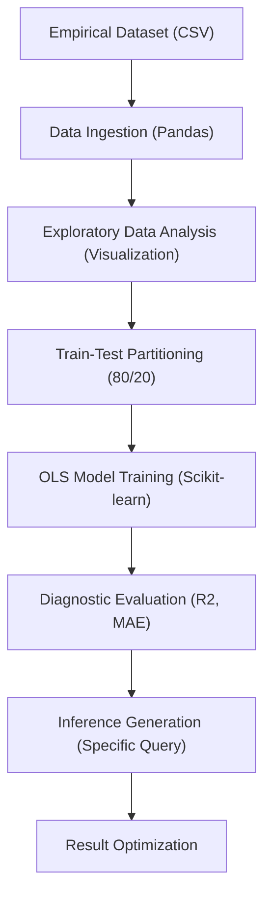

# Technical Specification: Supervised Machine Learning

## Architectural Overview

**The Sparks Foundation - Supervised Machine Learning** is a predictive analytics study designed to demonstrate the application of classical linear regression in estimating academic performance. The project serves as a digital exploration into foundational machine learning heuristics, established during a Data Science and Business Analytics internship program.

### Data Science Pipeline

---

## Technical Implementations

### 1. Modeling Architecture
-   **Core**: Built on **Scikit-learn**, specifically utilizing the `LinearRegression` class for Ordinary Least Squares (OLS) optimization.
-   **Estimation Logic**: Establishing a univariate relationship between independent (Study Hours) and dependent (Score Percentage) variables.

### 2. Evaluation & Validation
-   **Metrics**: Implements a multi-faceted evaluation strategy using Coefficient of Determination ($R^2$), Adjusted R-Squared, and Mean Absolute Error (MAE) to quantify residual variance.
-   **Reproducibility**: Utilizes defined random states during dataset partitioning to ensures consistent and verifiable analytical outcomes.
-   **Heuristics**: Scalable predictive logic capable of processing arbitrary numerical inputs within the logical domain of the primary distribution.

### 3. Developmental Infrastructure
-   **Notebook Runtime**: The primary research was conducted in **Google Colab**, leveraging hosted TPU/GPU resources for iterative experimentation.
-   **Source Production**: The analytical kernel is cross-compiled into a standalone **Python Script** for production-ready execution and scholarly reference.

---

## Technical Prerequisites

-   **Runtime**: Python 3.7+ environment (Local or Cloud-based).
-   **Dependencies**: `pandas`, `numpy`, `matplotlib`, `seaborn`, and `scikit-learn` libraries.

---

*Technical Specification | Data Science | Version 1.0*
